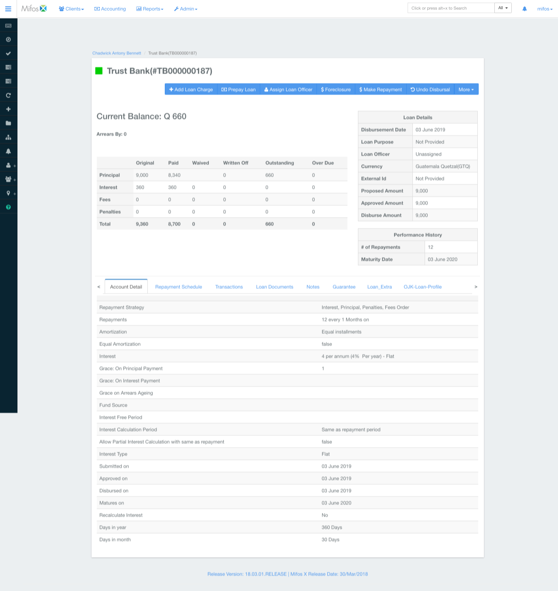
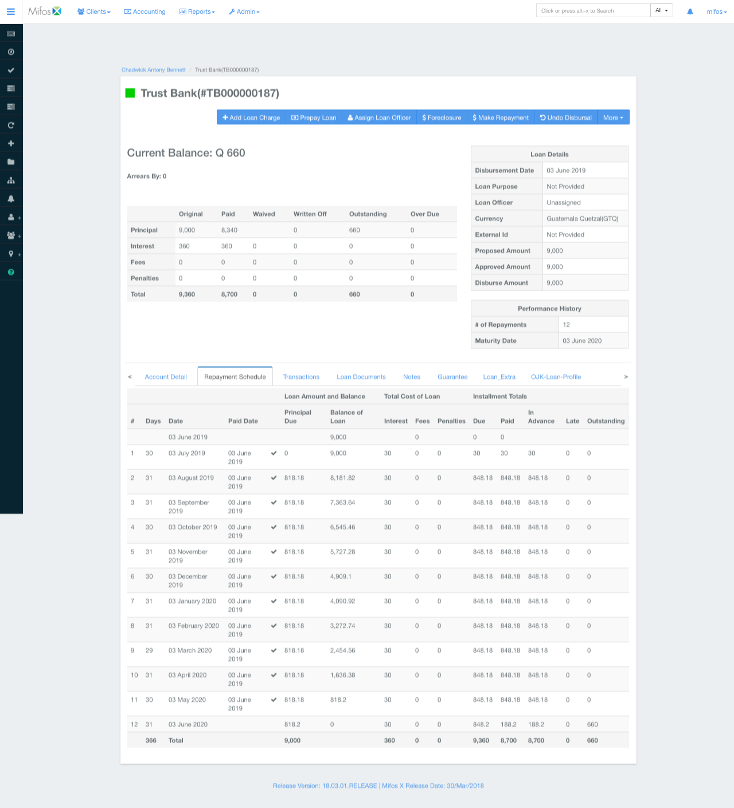
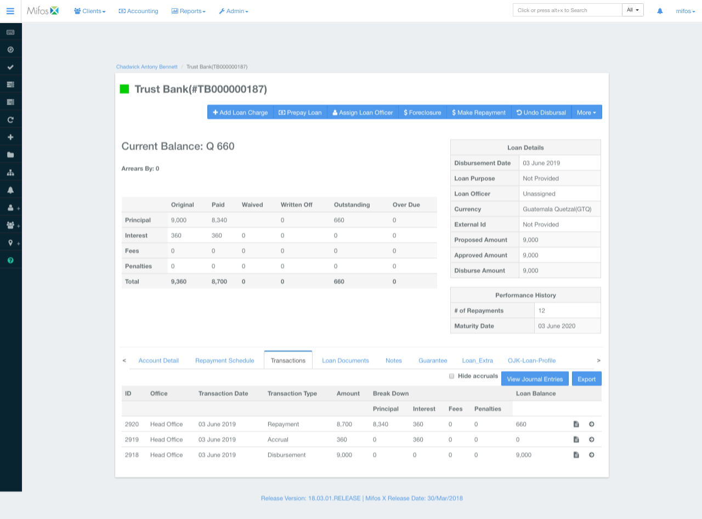

# [v0.1] Enable Product Specs

**Codename:** "Ines"

**Status**:

In Progress (under discussion)

**Authors:**

[Daniel Onggunhao](https://daniel.ai)

**Reviewers:**

---

## Summary

We are building a reusable **crowdfund Dai loan kit**. This uses smart contracts to allow a borrower to borrow from and repay many lenders in Dai. The smart contract will keep track of fractional loan ownership and accounting.

This will be a proof-of-concept "n=1" fundraise for a single loan for a single borrower, and released as a reusble kit. This is the first step towards

## Business Case

We are using Ines' need to raise 60,000 Dai to pay for her Cornell degree to drive our business use case. The success state is her being able to raise the amount from lender, and successfully pay back the loan over 12 months.

## Functional Spec

### Personas

* `Borrower`

* `Lender`: (many) owns fractional shares of the loan, giving them right to repayment

* `Operator`: the operator of the loan contract

### Journey

#### Loan Creation

1. `Borrower` (with the help of `operator`) creates an on-chain loan request by committing to a set of loan terms (i.e. princpal amount, interest, time period). Borrower supplies a writeup and a video explaining the fundraise that is stored off-chain.

1. Potential `lenders` can view the loan request in a Kiva or GoFundMe-style UI. This should show the projected repayment table. This should show who else has contributed to the loan. The lend button should always be visible on the page.

#### Crowdfunding Stage

1. **[To discuss]**: `Lender` starts the lending process by filling out their details (for KYC) through a web form. This should be written to an off-chain database.

1. `Lender` chooses their funding amount in Dai. The UI should check whether the lender has sufficient Dai available. The UI should also check whether the lent amount would exceed the fundraising amount, and advise the lender to lower the amount. The UI should also show the simulated repayment schedule, and lender's profit from the loan.

1. **[To discuss]** `Lender` can opt to have a video interview with the `borrower`

1. `Lender` uses Metamask to transfer the Dai amount to the loan contract. If there is an error, it should show the error on the UI.

1.  `Lender` should be directed to a "My Loan" page after contributing, where they can see how many loan shares they have, and their balance (currently $0).

1. **[To discuss]** `Lender` should receive an email acknowledging their loan to the borrower, with the amount and address.

1. **[To discuss]** There should be an event emitted with the lender's amount donated, timestamp, and lender address. The UI should update to show the new lender.

#### [To discuss] Crowdfunding Stage (Part 2)

> **Daniel's thoughts**: For v0.1, can we do away with this step? Are there legal ramnifications to this, e.g. if loaned funds come from a blacklisted address?

1. **[To discuss]** If the loan has not been started, `lenders` should be able to change their mind and refund their loaned amount.

2. **[To discuss]** If the `borrower` (or `operators`) find something wrong with a lending address (e.g. blacklisted, stolen funds), they should be able to forcibly refund the loaned amount for that address and prevent them from participating in the loan

#### Loan Starting

1. If the crowdfunding has not been hit, `Borrower` should have the choice of (a) starting the loan with a smaller amount of principal, or (b) refunding the amounts to the `lenders`.

1. `Borrower` will start the loan through a UI. This will indicate that they agree to repay the loan according to the payment schedule.

1. Starting the loan will create a `loanStartTimestamp`. This will be used to calculate the due dates for each repayment tranche. The UI will show the scheduled repayment date in the payment table.

1. **[To discuss]** `Borrower` can then withdraw money to an account through a UI. They can specify the amount to withdraw, to allow for 1 Dai test withdrawals. There should be an option for them to specify the address to withdraw to, which should be prefilled with their Metamask address.

#### Repayment Cycle

1. `Borrower` will make monthly repayments for the loan through a UI. This will transfer Dai from the borrower's wallet to the loan contract.

1. `Borrower` should be able to specify the amount to transfer into the loan. This enables them to do "test" transfers (e.g. 1 Dai).

1. The "My Loan" page should show an updated Loan Status as well as a Payments Table for the loan. This should show whether a loan is current, late (within 30 days), or in default (> than 30 days). The Payments table should show if a payment for a certain month is paid (i.e. before due date), or if it is in default.

1. The Loan Contract should be able to calculate whether a loan is in default or on time, by comparing the TotalRepaidAmount (sum of all repayments the borrower has made) to the ExpectedRepaidAmount for a given timestamp. This is the same for a given scheduled payment.

1. If the `borrower` defaults, the My Loan page should show that the loan is in default, and the amount that is in arrears. The payments table should show Default or Late for the set of repayments.

1. **[To discuss]** Whenever the `borrower` makes a repayment or defaults, an email should be sent to `lenders` to update them, update them on their account balance, and give them instructions on how to withdraw.

#### Lender Withdrawals

1. `Lenders` should be able to see the number of loan shares they have, their current account balances, and how much they have previously withdrawn from their balance.

1. The account balance is their fraction of total repayments made by the borrower at any point in time. If a lender owns 25% of the loan, then he is entitled to withdraw 25% of the repayments.

4. **[To discuss]** `Lenders` should be able to withdraw a certain amount from their account balance through the UI (to allow for "test" transactions). This will transfer their account balance from their wallet. The UI should update once the `Lenders` balance.

5. **[To discuss]** `Lender` successfully making a withdrawal should emit an event. `Operators` can use events emitted as a way of keeping track of which lender has made a withdrawal on their balance.

## Designs

See PDF

## Out of Scope

### Our constraints

1. We only have a small volunteer team of 2-3 software engineers on a 5k allowance
1. Want to validate smallest idea first (e.g. on-chain P2P loans)
1. Needs to be well tested

### Features pushed to future releases

1. **"Marketplace"**: need to validate single loan idea before we support for multiple loans + new loans.

3. **Tradeable debt tokens**: this increases (significantly) the surface area for attacks

4. **Collateralized loans**: current business case does not allow for this (i.e. Ines)

5. **Sophisticated loan types**: this covers mortgage-style "PMT" loan calculations, grace periods

6. **Sophisticated payment tracking**: calculating dynamic interest penalties based on time, tracking early settlement discounts

7. **Some of the "To Discuss" notes above**: pending our discussion

## Supporting Material

These are screenshots from Mifos (an open source core banking system) that can give us a clearer idea of what data fields might be needed.

### Overall loan overview
* Similar to "My Loan" page. See # of repayments, Maturity Date, Table

### Repayment Schedule
* Similar to our "Payment Table" in our smart contract

### Transactions
* Similar to our repayments by borrower

